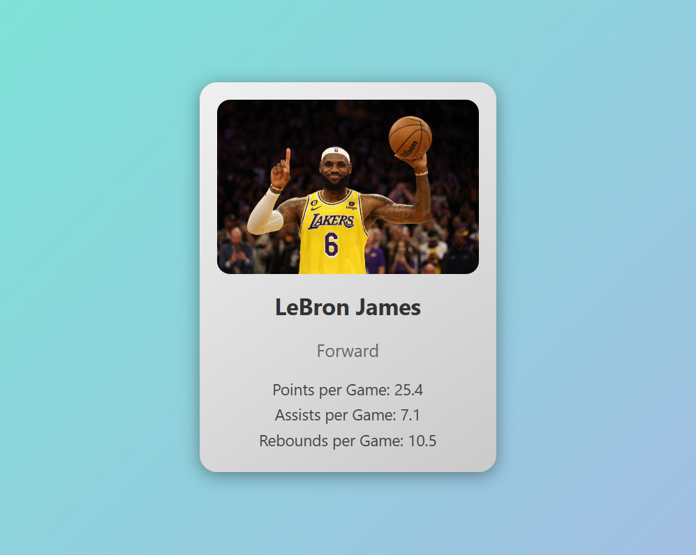

# Basketball Player Card

This project displays a basketball player's information in a card format using a React component. The card includes the player's name, image, position, and stats, with modern styling and animations.

## Demo

Check out the live demo of the project [here](https://basketball-player-card-beta.vercel.app/).
Check out the github repository [here](https://github.com/zeeshan-akhter/basketball-player-card).

## Screenshot



## Features

- Display a basketball player's image, name, position, and stats.
- Modern and appealing design with gradients and hover animations.
- Responsive design that looks good on different screen sizes.

## Installation

Follow these steps to set up and run the project locally:

1. **Clone the repository**:

   ```bash
   git clone https://github.com/zeeshan-akhter/basketball-player-card.git
   cd basketball-player-card
   ```

2. **Install dependencies**:

   ```bash
   npm install
   ```

3. **Start the development server**:
   ```bash
   npm start
   ```

The application will be running on `http://localhost:3000`.

## Usage

The `BasketballPlayerCard` component accepts the following props:

- `name` (string): The player's name.
- `image` (string): URL to the player's image.
- `position` (string): The player's position.
- `stats` (object): An object containing the player's stats (e.g., `{ pointsPerGame: 25.4, assistsPerGame: 7.1, reboundsPerGame: 10.5 }`).

Example usage:

```jsx
<BasketballPlayerCard
  name="LeBron James"
  image="https://example.com/lebron.jpg"
  position="Forward"
  stats={{ pointsPerGame: 25.4, assistsPerGame: 7.1, reboundsPerGame: 10.5 }}
/>
```

## File Structure

```
basketball-player-card/
├── public/
├── src/
│   ├── components/
│   │   ├── BasketballPlayerCard.js
│   │   ├── BasketballPlayerCard.css
│   ├── App.js
│   ├── App.css
|   ├── index.css
│   ├── index.js
├── .gitignore
├── package.json
├── README.md
├── screenshot.png
```
